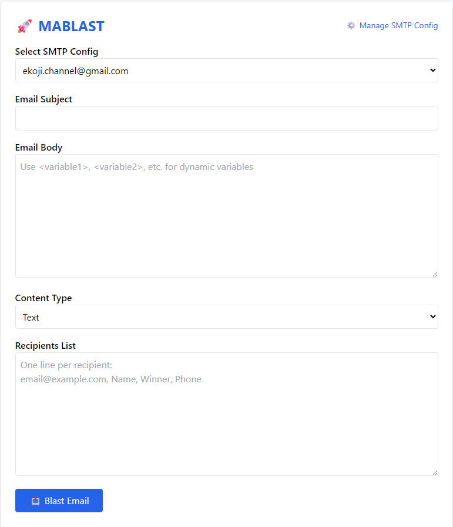

# 🚀 Mablast-Email-Blaster

A powerful Flask-based mass email sender with dynamic variables, multiple SMTP configurations, and comprehensive logging.



## ✨ Features

- 📧 **Mass Email Sending** - Send bulk emails with dynamic variable replacement
- 🔧 **Multiple SMTP Support** - Manage multiple SMTP configurations
- 🎯 **Dynamic Variables** - Use `<variable1>`, `<variable2>`, etc. in email templates
- 📊 **Email Logging** - Track all sent emails with Supabase integration
- 🎨 **Clean UI** - Modern interface with Tailwind CSS
- ⚡ **Real-time Progress** - Live email sending status updates

## 🛠️ Tech Stack

- **Backend:** Flask (Python)
- **Frontend:** HTML + Tailwind CSS + JavaScript
- **Database:** Supabase (PostgreSQL)
- **Email:** SMTP Protocol

## 🚀 Quick Start

### Prerequisites
- Python 3.7+
- Supabase account and project

### Installation

1. **Clone the repository**
```bash
git clone https://github.com/yourusername/Mablast-Email-Blaster.git
cd Mablast-Email-Blaster
```

2. **Install dependencies**
```bash
pip install -r requirements.txt
```

3. **Configure environment variables**
Create a `.env` file:
```env
SUPABASE_URL=your_supabase_url
SUPABASE_KEY=your_supabase_anon_key
SECRET_KEY=your_secret_key
```

4. **Run the application**
```bash
python app.py
```

5. **Access the application**
Open `http://127.0.0.1:5000` in your browser

## 📖 Usage

### 1. Setup SMTP Configuration
- Go to "⚙️ Kelola SMTP Config"
- Add your SMTP settings (Gmail, Outlook, etc.)
- For Gmail: Use App Password, not regular password

### 2. Send Mass Emails
- Select SMTP configuration
- Write email subject and body
- Use dynamic variables: `<variable1>`, `<variable2>`, etc.
- Add recipients in format: `email@domain.com, Name, Value1, Value2`

### 3. Example Usage

**Email Template:**
```
Hello <variable1>,
Congratulations! You are now <variable2>.
Contact: <variable3>
```

**Recipients List:**
```
john@example.com, John Doe, Champion, 08123456789
jane@example.com, Jane Smith, Runner-up, 08987654321
```

**Result for John:**
```
Hello John Doe,
Congratulations! You are now Champion.
Contact: 08123456789
```

## 🗄️ Database Schema

Required Supabase tables:

### `blaster_smtp_config`
```sql
CREATE TABLE blaster_smtp_config (
  id SERIAL PRIMARY KEY,
  name VARCHAR(255) NOT NULL,
  smtp_host VARCHAR(255) NOT NULL,
  smtp_port INTEGER NOT NULL,
  smtp_user VARCHAR(255) NOT NULL,
  smtp_pass VARCHAR(255) NOT NULL,
  created_at TIMESTAMP DEFAULT NOW()
);
```

### `blaster_email_logs`
```sql
CREATE TABLE blaster_email_logs (
  id SERIAL PRIMARY KEY,
  to_email VARCHAR(255) NOT NULL,
  subject TEXT,
  body TEXT,
  body_type VARCHAR(10) DEFAULT 'text',
  status VARCHAR(20) NOT NULL,
  error_msg TEXT,
  created_at TIMESTAMP DEFAULT NOW()
);
```

## 🔧 Configuration

### Gmail SMTP Settings
- Host: `smtp.gmail.com`
- Port: `587`
- Username: Your Gmail address
- Password: App Password (not regular password)

### Outlook/Hotmail SMTP Settings
- Host: `smtp-mail.outlook.com`
- Port: `587`
- Username: Your Outlook address
- Password: Your account password

## 🤝 Contributing

1. Fork the repository
2. Create your feature branch (`git checkout -b feature/AmazingFeature`)
3. Commit your changes (`git commit -m 'Add some AmazingFeature'`)
4. Push to the branch (`git push origin feature/AmazingFeature`)
5. Open a Pull Request

## 📝 License

This project is licensed under the MIT License - see the [LICENSE](LICENSE) file for details.

## 🙏 Acknowledgments

- Flask framework for the web application
- Supabase for database and backend services
- Tailwind CSS for the beautiful UI

---

**Made with ❤️ by [Your Name]**

*Mablast-Email-Blaster - Blast your emails with style!* 🚀